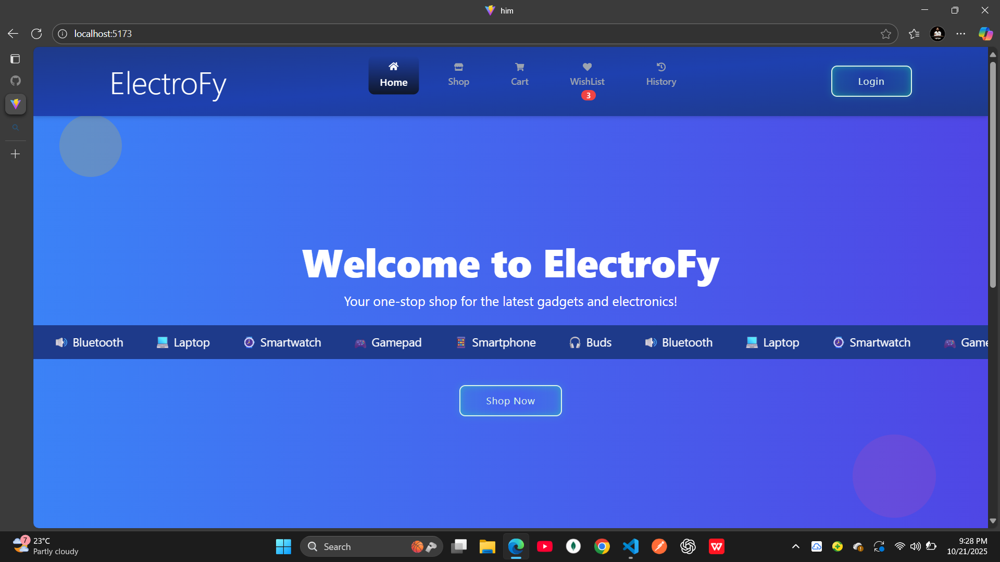
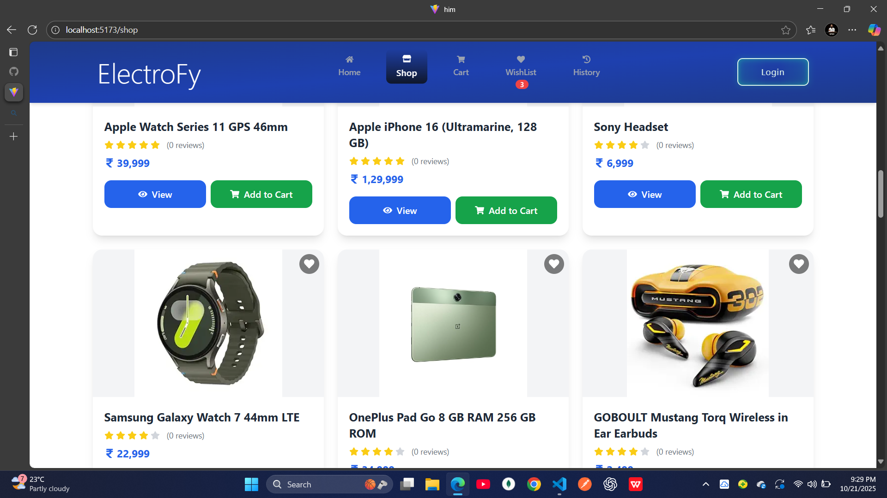
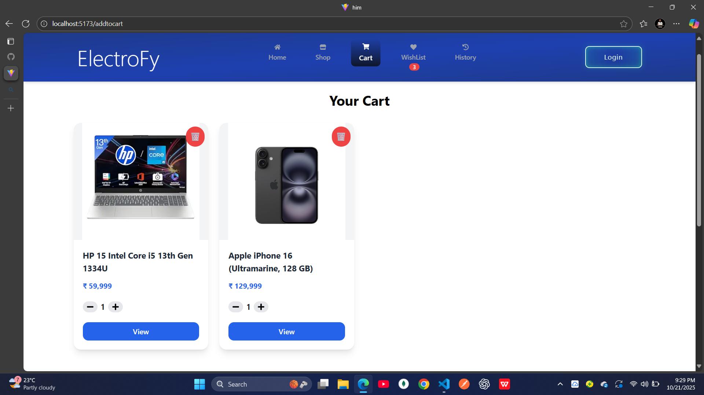
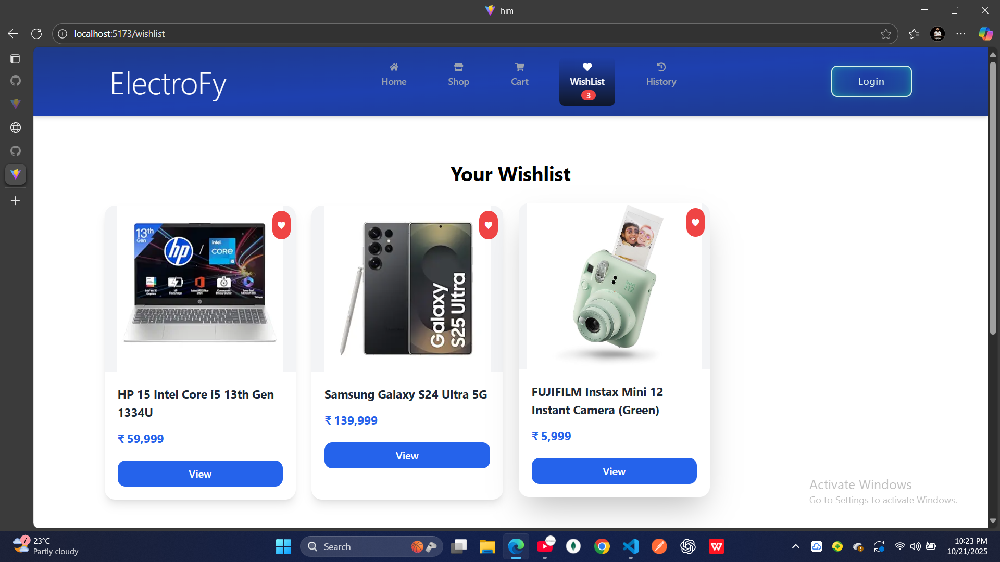
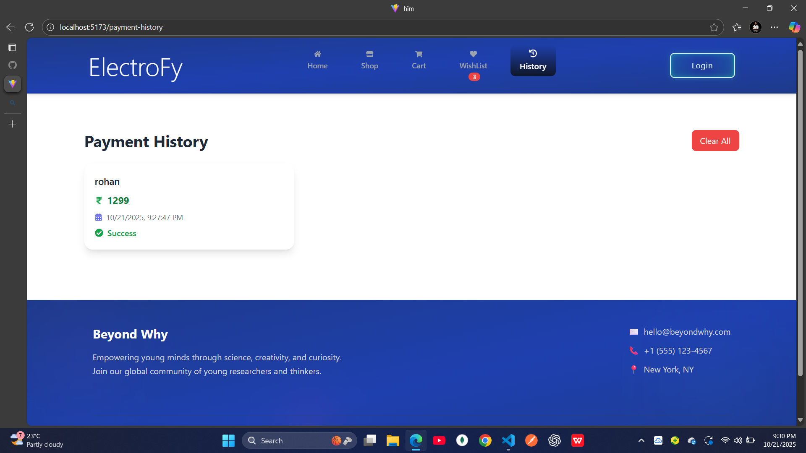

# ⚡ Electrofy

> A modern and responsive electronics e-commerce website built with **React + Tailwind CSS**.  
> Explore, add to cart, wishlist, and enjoy a seamless shopping experience!

---

## 📸 Project Overview

Electrofy is a full-featured e-commerce web app where users can:
- Browse electronic products
- View detailed product information
- Add to cart or wishlist
- Make payments securely
- Manage products dynamically with a clean UI

---

## 🖼️ Screenshots

Below are some real screenshots from the Electrofy project 👇  

### 🏠 Home Page


### 📱 Product Details Page


### 🛒 Cart Page


### 🛒 WishList Page


### 🛒 History Page



## 🎥 Demo Video

Watch a short demo of the project in action 👇  

<video src="src/assets/screenshots/demo.mp4" width="700" controls></video>

> 🎬 Place your video inside:
> ```
> /assets/screenshot
> └── demo.mp4
> ```

---

## ⚙️ Tech Stack

**Frontend:**
- React.js  
- React Router  
- Tailwind CSS  
- aos for animations
- toast for notifications


**Other Tools:**
- Context API / Redux  


## 🚀 Getting Started

### 1️⃣ Clone the repository
```bash
git clone https://github.com/tambehimanshu/electrofy.git
cd electrofy
npm i
npm run dev